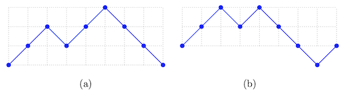
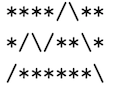
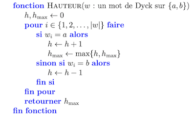

# Travail pratique 1: Chemin de Dyck

**Lisez bien le sujet jusqu'au bout avant de commencer à travailler sur le projet.**


## Objectifs pédagogiques

Les principaux objectifs pédagogiques visés sont les suivants:

- Vous initier au langage de **programmation C**.
- Vous initier à l'utilisation du logiciel de contrôle de versions **Git** lors
  d'un développement en **solitaire**.
- Vous familiariser à la compilation d'un programme à l'aide d'un **Makefile** simple.
- Vous habituer à décomposer un programme en **petites fonctions**.
- Vous familiariser avec le passage d'arguments par **adresse**.
- Vous familiariser avec l'utilisation de l'**entrée standard** (`stdin`) et de
  la **sortie standard** (`stdout`)
- Vous familiariser avec le traitement des **arguments** d'un programme et des
  **codes de retour**

## Description du travail

Le but de votre travail sera d’ ́ecrire un programme C nommé `motdedyck.c` qui saisira en entrée des mots de Dyck et qui dessinera le chemin correspondant. La lecture devra se faire sur l'entrée standard (`stdin`) et le résultat est ensuite affiché sur la sortie standard(`stdout`).

Votre programme devra avoir un comportement très précis afin d'automatiser la correction, mais également afin d'automatiser les tests. Vous devrez donc vous assurer de ne pas écrire de messages superflus sur `stdout` ou`stderr` et de bien écrire **tels quels** les messages d'erreurs.

### Théorie

Afin de bien comprendre ce que je vous demande de faire, je vous donne d’abord un peu de théorie sur la combinatoire des mots et plus particulièrement sur les mots de Dyck.

Un `alphabet` est un ensemble fini dont les éléments sont appelés `lettres`. Un `alphabet` est dit `binaire` s’il contient deux eléments et `ternaire` s’il en contient trois. Un mot sur un `alphabet` est une suite (finie ou infinie) de lettres de cet `alphabet`. Dans ce travail, on ne s’intèressera qu’aux mots finis. Un mot `u` est appelé `préfixe` d’un autre mot `w` s’il existe un troisième mot `x` tel que `w = ux`. La longueur d’un mot `w`, notée `|w|`, est donnée par le nombre de lettres le composant.

**Exemple :** Les ensembles `A = {0,1} et B = {a,b,c}` sont respectivement des `alphabets binaire et ternaire`. De plus, `u = 0100` est un mot sur A alors que `v = abccaab` est un mot sur B. Les mots `ab`, `abc` et `abccaab` sont tous des `préfixes` de `v`.
Un mot de Dyck `w` sur un alphabet binaire {a,b} est un mot satisfaisant les deux propriétes suivantes :


   (i) Il y a autant de `a` que de `b` apparaissant dans `w` ;
   
   
  (ii) Pour tout préfixe `u` de `w`, `u` contient toujours au moins autant de `a` que de `b`.

Il est plus simple de représenter des mots de Dyck géométriquement.

Étant donné un mot de Dyck `w` sur un `alphabet` ordonné (a, b), son chemin de Dyck correspondant est donné en remplaçant chacune des occurrences de `a` par un pas de vecteur (1, 1) et chacune des occurrences de `b` par un pas de vecteur (1, −1). 

Des exemples de chemins sont illustrés à la `figure 1`.



**Figure 1** – _Représentation graphique (a) du chemin de Dyck décrit par le mot aabaabbb et (b) d’un chemin décrit par le mot aababbba qui n’est pas un mot de Dyck, car le préfixe aababbb viole la condition (ii)_.

Remarquez que cette famille de mots a des applications en informatique, notamment en théorie de la compilation. Plus précisément, un mot de Dyck décrit une expression bien parenthésée, où chaque pas ascendant correspond à une parenthèse ouvrante et chaque pas descendant correspond à une parenthèse fermante.

### Description du programme

Votre programme devra saisir en entrée (sur `stdin`) une chaîne de caractères de la forme :

`<lettre1> <lettre2> <mot sur les deux lettres>`. Pour faciliter la correction, `stdin` sera redirigé vers un fichier avec le même contenu.

```sh
$ cat entree.txt 
   <lettre1> <lettre2> <mot sur les deux lettres>
```


Vous pouvez supposer que l’utilisateur n’entrera pas une chaîne de plus de 100 caractères. En revanche, les deux lettres et le mot peuvent être séparés par un nombre arbitraire de caractères d’espacement et de tabulation. D’autre part, tout mot de taille plus grande que 40 sera refusé. Il devra ensuite valider s’il s’agit d’un mot de Dyck sur l’alphabet donné. Si ce n’est pas le cas, il devra afficher un message d’erreur en conséquence.



**Figure 2** – _Représentation ASCII du mot de Dyck aabaabbb._


Notez que ces messages d’erreur ne doivent comporter aucun **accent**, doivent être ecrits en minuscules et sans espace au début et à la fin : bref, ils doivent être orthographiés exactement comme décrit plus bas, car vos programmes seront vérifiés de façon automatique.

Si le mot donné est bien un mot de Dyck, alors le programme affiche sur la sortie standard un dessin ASCII du chemin de Dyck correspondant au mot donné. La `figure 2` illustre les sorties correspondant au mot de la `figure 1`. L’affichage doit se faire **exactement** comme suit :

* Les pas montants sont représentés par le caractère “slash” `/` ;
* Les pas descendants sont représentés par le caractàre “backslash” `\` ;
* Les espaces vides doivent être remplacés par des astérisques `*` ;
* Il ne doit y avoir aucune colonne et aucune ligne superflue, c’est-à-dire ne contenant que des astérisques.

En dernier lieu, votre programme doit accepter un argument optionnel `hauteur` (un paramètre de la fonction main). Lorsque cet argument est donné, vous devez afficher la hauteur du chemin plutôt que dessiner sa représentation ASCII. Optionnellement, vous accepterez un autre paramètre `aire` qui retournera l’aire sous le chemin décrit par le mot de Dyck en remplacement de l’affichage ASCII.


Finalement, vous ne devez inclure **aucun texte supplémentaire** : pas de ligne d’invite du genre
"Veuillez entrer votre mot: " ou de commentaire à la sortie "Voici le dessin".

Les messages d’erreur à afficher doivent être de la forme suivante :

* **"mot trop long"** si le mot a une taille de plus de 40 caractères ;
  
* **"lettre interdite"** si une lettre différente de `lettre 1` et `lettre 2` apparaît dans le mot donné comme dernier argument ;
    
* **"mot non equilibre"** si le nombre d’occurrences de `lettre 1` est différent du nombre d’occurrences de `lettre 2` ou si le chemin correspondant passe sous la droite y = 0 lorsqu’on le dessine ;
  
* **"donnees invalides"** si les deux premières données ne sont pas des caractères, s’il n’y a pas exactement trois données (deux lettres et un mot) ou si les deux lettres données sont egales ;
  
* **"argument invalide"** si un argument différent de "hauteur" ou "aire" est donnée ou si plus d’un argument est donné à la fonction main.


Lorsque vous lancez le programme sans argument (alphabet et mot), un manuel d'utilisation doit
être affiché sur la sortie standard:

```text
$ ./motdedyck
Usage: ./motdedyck [HEIGHT,AREA] <LETTER 1> <LETTER 2> <WORD>

Draws on an ASCII path of dyck's word. The dyck's word is provided on stdin and
the result is printed on stdout. The length of the word must not exceed 40 characters.

If no argument is provided, the program prints this help and exit.

Program parameters :

  HEIGHT                    Optional parameter to calculate the height of the path under
                            the word of dyck
                                                 
  AREA                      Optional parameter to calculate the height of the path under 
                            the word of dyck
                            
  LETTER 1, LETTER 2        Define the alphabet of the word
  
  WORD                      Word of dyck to represent
                           
```

## Exemples d'utilisation

Voici une liste partielle des entrées que votre programme devra traiter et des sorties attendues. 

Vous pouvez exécuter votre programme de façon différente : 

```sh
$ ./motdedyck < entree.txt 
```

Dans le cas des paramètres hauteur et aire, ce sera plutôt la syntaxe :

```sh
$ ./motdedyck hauteur < entree.txt

    ou 
      
$ ./motdedyck aire < entree.txt
```

Voici quelques exemples d'entrées et de sorties attendues.

### Exemple 1 : 

```text
ENTRÉE :

a b aabaababbabb

SORTIE :

****/\/\****
*/\/****\/\*
/**********\

```

### Exemple 2 : 

```text
ENTRÉE :

0    1   001001011011

SORTIE :

****/\/\****
*/\/****\/\*
/**********\
```

### Exemple 3 : 

```sh
ENTRÉE :

a b    abba

SORTIE :

mot non equilibre
```

### Exemple 4 : 

```sh
ENTRÉE :

a b ababababababababababababababababababababa

SORTIE :

mot trop long
```

### Exemple 5 : 

```sh
ENTRÉE :

a b aab

SORTIE :

mot non equilibre
```

### Exemple 6 : 

```sh
ENTRÉE :

a b aacbbd

SORTIE :

lettre interdite
```

### Exemple 7 : 

```sh
PARAMÈTRE : hauteur

ENTRÉE    :

a b aababb

SORTIE    :

2
```

### Exemple 8 : 

```sh
PARAMÈTRE : aire

ENTRÉE    :

a b aabaabbb

SORTIE    :

12
```

### Exemple 9 : 

```sh
PARAMÈTRE : banane

ENTRÉE    :

a b aabaabbb

SORTIE    :

argument invalide
```

### Exemple 10 : 

```sh
ENTRÉE    :

ab aabaabbb

SORTIE    :

donnees invalides
```


Voir le fichier [`check.bats`](check.bats) pour plus d'exemples de test. En cas
de doute sur le comportement à adopter dans certaines situations, n'hésitez pas
à poser des questions à l'enseignant.

## Suggestions et indices

Bien que ce ne soit pas obligatoire, je vous suggère d’utiliser les types suivants dans votre travail.

// Statut
```c
typedef enum {
    OK                          = 0,
    ERREUR_ARGUMENTS_INVALIDES  = 1,
    ERREUR_DONNEES_INVALIDES    = 2,
    ERREUR_MOT_TROP_LONG        = 3,
    ERREUR_LETTRE_INTERDITE     = 4,
    ERREUR_MOT_NON_EQUILIBRE    = 5
}Statut;
```

// Mot de Dyck
```c
typedef enum {
    char mot[TAILLE_MOT];
    char haut;
    char bas;
}MotDeDyck;
```

De plus, vous pouvez vous inspirer du pseudocode suivant pour calculer la hauteur
d’un mot de Dyck :




## Tâches à accomplir

Afin de compléter ce travail pratique, vous devrez suivre les étapes suivantes:

1. Créez un clone (*fork*) du [dépôt du projet](https://gitlab.info.uqam.ca/inf3135-sdo/h22-inf3135-tp1).
2. Assurez-vous que le dépôt soit privé, pour éviter le plagiat.
3. Donnez accès à votre dépôt à l'utilisateur `dogny_g` en mode `Developer`.
4. Familiarisez-vous avec le contenu du dépôt, en étudiant chacun des fichiers
   (`README.md`, `sujet.md`, `check.bats`, `.gitlab-ci.yml`, etc.).
5. Commencez votre développement en versionnant fréquemment l'évolution de
   votre projet avec Git. La qualité de votre versionnement sera évaluée, il
   est donc important de valider (*commit*) chaque fois que vous avez terminé
   une petite tâche.
6. Ajoutez un fichier `Makefile` pour qu'il exécute toutes les tâches
   demandées.
7. Complétez le fichier `README.md` en respectant le format Markdown et en
   tenant compte des instructions qui y sont présentes.
8. Complétez le fichier `motdedyck.c`.

### Clone et création du dépôt

Vous devez cloner le dépôt fourni et l'héberger sur la plateforme [Gitlab du
département](https://gitlab.info.uqam.ca/). Votre dépôt devra se nommer
**exactement** `h22-inf3135-tp1` et l'URL devra être **exactement**
`https://gitlab.info.uqam.ca/<utilisateur>/h22-inf3135-tp1`, où
`<utilisateur>` doit être remplacé par votre code MS de l'UQAM ou par votre nom
d'utilisateur. Il devra être **privé** et accessible seulement par vous et par
l'utilisateur `dogny_g`.

### Fichier `motdedyck.c`

L'organisation du contenu de votre fichier `motdedyck.c` est laissée à votre
discrétion, mais je vous suggère tout de même d'utiliser minimalement les
déclarations suivantes (n'oubliez pas de les documenter):

```c
#define TAILLE_MOT 40
#define USAGE "\
Usage: %s [HEIGHT,AREA] <LETTER 1> <LETTER 2> <WORD>\n\
\n\
Draws on an ASCII path of dycks word. The dycks word is provided on stdin and\n\
the result is printed on stdout. The length of the word must not exceed 40 characters.\n\
\n\
If no argument is provided, the program prints this help and exit.\n\
\n\
Program parameters :\n\
  HEIGHT                    Optional parameter to calculate the height of the\n\
                            path under the word of dyck.\n\
  AREA                      Optional parameter to calculate the height of\n\
                            the path under the word of dyck.\n\
  LETTER 1, LETTER 2        Define the alphabet of the word.\n\
  WORD                      Word of dyck to draw.\n\
  "

struct motDeDyck {
    char mot[TAILLE_MOT];   //Le mot saisi
    char haut;              //Caractere ascendant
    char bas;               //Caractere descendant
};

enum error {
    OK                          = 0,
    ERREUR_ARGUMENTS_INVALIDES  = 1,
    ERREUR_DONNEES_INVALIDES    = 2,
    ERREUR_MOT_TROP_LONG        = 3,
    ERREUR_LETTRE_INTERDITE     = 4,
    ERREUR_MOT_NON_EQUILIBRE    = 5
};
```

### Makefile

Vous devrez supporter les cibles suivantes dans votre Makefile:

- La commande `make` crée l'exécutable `motdedyck` s'il y a eu une modification
  du fichier `motdedyck.c` en le compilant selon le standard C11, avec les
  options `-Wall` et `-Wextra` lors de la compilation.
- La commande `make html` transforme les fichiers `README.md` et `sujet.md` en
  HTML à l'aide du logiciel [Pandoc](https://pandoc.org/) en utilisant le style
  CSS fourni dans le fichier [`misc/github-pandoc.css`](misc/github-pandoc.css)
- La commande `make test` recompile l'exécutable si nécessaire, puis lance la
  suite de tests contenue dans le fichier `check.bats` **non modifié**, livré
  dans le dépôt que vous avez cloné.
- La commande `make clean` supprime les fichiers inutiles ou générés (`.o`, `.html`, etc.).

N'oubliez pas les **dépendances** pour chaque cible s'il y en a.

### Fichier `README.md`

Vous devez compléter le fichier `README.md` livré dans le dépôt en suivant les
instructions qui y sont indiquées. Assurez-vous également de répondre aux
questions suivantes:

- À quoi sert votre programme?
- Comment le compiler?
- Comment l'exécuter?
- Quels sont les formats d'entrées et de sorties?
- Quels sont les cas d'erreur gérés?

Vous devez utiliser la syntaxe Markdown pour écrire une documentation claire et
lisible. Vous pouvez en tout temps vérifier localement le fichier HTML produit
sur votre machine à l'aide de [Pandoc](https://pandoc.org/), mais il est aussi
conseillé de vérifier, avant la remise finale, que le résultat produit sur la
page d'accueil de GitLab est celui auquel vous vous attendez.

Évitez d'abuser du gras, de l'italique et du HTML brut dans le fichier
`README.md`. Exploitez au maximum les listes à puces et formatez les noms de
fichier et le code à l'aide des apostrophes inversés. Finalement, soignez la
qualité de votre français, qui sera prise en considération dans le fichier
`README.md`.

### Git

Il est important de suivre l'évolution de votre projet à l'aide de Git. Vous
devez cloner (à l'aide du bouton *fork*) le gabarit du projet fourni et ajouter
vos modifications à l'aide de *commits*. En particulier, il est possible que je
doive apporter des corrections ultérieures à l'énoncé que vous pourrez
récupérer facilement si nous avons un historique **commun**.

N'oubliez pas de bien configurer correctement votre fichier `.gitconfig` qui
permet de vous identifier comme auteur de *commits*, en y indiquant vos
**véritables** prénom, nom et courriel.

Les messages de *commit* doivent suivre une des conventions suivantes:

- [How to write a Git commit
  message](https://chris.beams.io/posts/git-commit/), par Chris Beams
- [Conventional commits](https://www.conventionalcommits.org/en/v1.0.0/), par
  différentes personnes

Finalement, n'oubliez pas d'inclure un fichier `.gitignore` en fonction de
votre environnement de développement. Aussi, assurez-vous de ne pas versionner
de fichiers inutiles (les fichiers binaires, entre autres, mais pas seulement).

### Correction

L'exécution de votre programme sera vérifiée automatiquement grâce à une suite
de tests rédigée en [Bats](https://github.com/bats-core/bats-core). Bien
entendu, vous devez installer Bats pour le faire fonctionner. Pour faciliter
votre développement, vous avez accès à un certain nombre de tests *publics*
pour corriger vos travaux (dans le fichier `check.bats`). Il suffit d'entrer la
commande

```sh
$ bats check.bats
```

pour lancer la suite de tests.

Cependant, prenez note que la couverture de tests n'est pas **complète**. Je me
réserve donc la possibilité d'ajouter des tests supplémentaires pour la
correction finale. Si vous avez un doute sur le comportement attendu d'une
certaine situation, je vous invite à me poser des questions pour que je puisse
apporter des précisions à l'ensemble de la classe si nécessaire.

### Pénalités

Tout programme qui ne compile pas se verra automatiquement attribuer
**la note 0**.

En outre, si vous ne respectez pas les critères suivants, une pénalité
de **50%** sera imposée :

- Votre dépôt doit se nommer **exactement** `h22-inf3135-tp1`
- L'URL de votre dépôt doit être **exactement**
  `https://gitlab.info.uqam.ca/<utilisateur>/h22-inf3135-tp1` où
  `<utilisateur>` doit être remplacé par votre identifiant
- L'utilisateur `dogny_g` doit avoir accès à votre projet en mode *Developer*.
- Votre dépôt doit être un *fork* du [gabarit fourni](https://gitlab.info.uqam.ca/inf3135-sdo/h22-inf3135-tp1).
- Votre dépôt doit être **privé**.
- Il est interdit d'utiliser les fonctions `getopt` et `getopt_long` des
  bibliothèques `unistd.h` et `getopt.h`.
- Il est interdit d'utiliser l'**allocation dynamique** dans ce travail (fonctions `malloc`, `calloc`, `realloc`, `free`).

## Remise

Le travail est automatiquement remis à la date de remise prévue. Vous n'avez rien de plus à faire. Assurez-vous d’avoir votre travail disponible sur votre branche `master/main` qui sera considérée pour la correction. Tous les commits après le **6 février 2022 à 23:55** ne seront pas considérés pour la correction.

### Barème

Les critères d'évaluation sont les suivants:

| Critère             |  Points |
|:--------------------|--------:|
| Fonctionnabilité    |     /50 |
| Qualité du code     |     /15 |
| Documentation       |     /15 |
| Makefile            |      /5 |
| Utilisation de Git  |     /15 |
| Total               |    /100 |

Plus précisément, les éléments suivants seront pris en compte:

- **Fonctionnalité (50 points)**: Le programme passe les tests *publics* et
  *privés* en affichant le résultat attendu.

- **Qualité du code (15 points)**: Les identifiants utilisés sont significatifs
  et ont une syntaxe uniforme, le code est bien indenté, il y a de l'aération
  autour des opérateurs et des parenthèses, le programme est simple et lisible.
  Pas de bout de code en commentaire ou de commentaires inutiles. Pas de valeur
  magique. Le code doit être bien factorisé (pas de redondance). Il est
  décomposé en petites fonctions qui effectuent des tâches spécifiques. La
  présentation est soignée. *Note*: si votre style est impeccable mais que
  votre travail est peu avancé, vous aurez peu de points pour cette partie.

- **Documentation (15 points)**: Le fichier `README.md` est complet et respecte
  le format Markdown. L'en-tête du fichier `motdedyck.c` est bien documentée,
  de même que chacune des fonctions (*docstrings*) en suivant le standard
  Javadoc.

- **Makefile (5 points)**: Le Makefile supporte les appels `make`, `make html`,
  `make test` et `make clean`. Toutes les dépendances de ces cibles sont
  présentes.

- **Utilisation de Git (15 points)**: Les modifications sont réparties en
  *commits* atomiques. Le fichier `.gitignore` est complet. Les messages de
  *commit* sont significatifs, uniformes et suivent une des conventions
  suggérées.

---

**Mise à jour le 11 janvier: Les bonus ont tous été distribués**.

~~Si vous êtes arrivé à ce stade du document, c'est que vous l'avez lu en entier, comme demandé dans la consigne au tout début du sujet. Envoyez en message privé au professeur sur le Slack une photo d'un animal mignon (p.-ex. une loutre, un chaton, un chiot, un capybara) pour en témoigner. Les cinq (5) premiers étudiants à remplir cette condition bénéficieront de cinq (5) points bonus sur l'évaluation de ce projet (la note maximale reste de 100)~~. 

---
